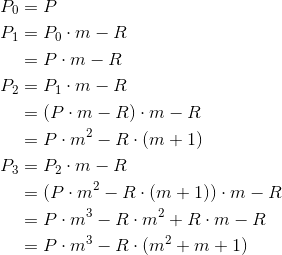
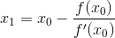
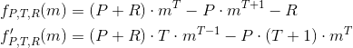

[](https://travis-ci.com/hansonhsc/loan-quote)
[](https://codecov.io/gh/hansonhsc/loan-quote/branch/master)
[](https://opensource.org/licenses/MIT)

# Loan Quote Calculator

The loan quote calculator is an example application that demonstrates how to create a rate calculation
system allowing prospective borrowers to obtain a quote from a pool of lenders for 36 month loans.

The system strives to provide as low a rate to the borrower as is possible to ensure that the quotes are as competitive
as they can be against competitors'. The borrower will also be provided with the details of the monthly repayment amount
and the total repayment amount.

## Usage

```bash
> java -jar loan-quote.jar [market_file] [loan_amount]
```

* `market_file` - Path to a CSV file containing a list of all the offers being made by the lenders within the system. See
[market.csv](src/test/resources/market.csv) for exact formatting
* `loan_amount` - Borrowers are able to request a loan of any £100 increment between £1000 and £15000 inclusive. If the
market does not have sufficient offers from lenders to satisfy the loan then the system would inform the borrower that
it is not possible to provide a quote at that time.

### Example

```bash
> java -jar loan-quote.jar market.csv 1000
Requested amount: £1000
Rate: 7.0%
Monthly repayment: £30.78
Total repayment: £1108.10
```

Repayment amounts are displayed to 2 decimal places and the rate of the loan is displayed to one decimal place.

## How is the quote calculated?

1. The list of lenders is read from the CSV file
0. Based on the requested loan amount, we find the lenders that will provide the lowest rates
0. Once the lenders are found, we calculate how much we need to borrow from each lender, which might not be the full
amount the lender can lend out
0. Once the loan amount for each lender is established, we calculate the monthly repayment for each lender based on
[amortized interest](https://en.wikipedia.org/wiki/Compound_interest#Exact_formula_for_monthly_payment), using this
formula:
   <p align="center">
   
   </p>
   where:

    - c = monthly payment
    - P = principal, i.e. loan amount
    - r = monthly interest rate, i.e. annual interest rate / 12
    - n = number of payment periods, i.e. 36

0. The monthly repayment displayed is then the sum of monthly repayment to each lender. This number is rounded up/down
to the nearest penny
0. The total repayment is the product of total repayment periods (36) and the total unrounded monthly repayment.
     - *Note that the total repayment amount might not be exactly 36 times of the displayed monthly repayment amount. When
issuing the amortized schedule, care needs to be taken in the last month to reconcile any overpayments or underpayments
each month due to extra or missing fractional pennies.*
0. The displayed loan rate is then calculated from the unrounded monthly repayment amount, loan amount and number of
payment periods (36).

### Calculating the loan rate

Before we calculate the loan rate, let's establish what values we have:

- loan amount: let's call this the **principal (P)**
- number of monthly payments: let's call this the **term (T)**
- monthly payment: let's call this the **payment (R)**
- interest rate: let's call this the **interest rate (r)**. *This is what we need to calculate to find the annual interest rate*

#### What happens every month?

Every month, the borrower pays a recurring amount (R), which includes paying interest and part of the principal still owed.
At the end of the payment term, the principal owed will be 0.

If *P<sub>i</sub>* is the principal owed currently after *i*
payments have been made, then:

- *P<sub>0</sub> = P*, the principal owed before any payments is the initial loan amount or principal
- *P<sub>T</sub> = 0*, nothing is owed at the end of the term

Due to compound interest, every month the interest is based on the principal owed. So the principal owed the next month
can be calculated by the monthly interest rate. The monthly interest rate can be calculated by dividing the annual interest
rate by 12.

The principal owed next month is then the principal owed this month plus the interest calculated, minus the payment made:

<p align="center">

</p>

To simplify things a little bit later, let's introduce a variable **m**, the monthly multiplier:

<p align="center">

</p>

This then means:

<p align="center">

</p>

#### How the principal changes month to month

The first 3 payment periods looks like this:

<p align="center">

</p>

Looking at how sequence progresses from *P<sub>3</sub>*, we can then define *P<sub>i</sub>* as:

<p align="center">

</p>

We can calculate the principal owed in a given month by the above formula.

#### Extracting a polynomial using *P<sub>T</sub>*

Substituting *T* as *i* for the above:

<p align="center">

</p>

But recall that *P<sub>T</sub> = 0*, therefore we have the following polynomial:

<p align="center">

</p>

Using the [formula for the sum of the first *n* terms of a geometric series](https://en.wikipedia.org/wiki/Geometric_series#Formula):

<p align="center">

</p>

We can simplify our polynomial:

<p align="center">

</p>

#### Solving the polynomial to find the interest rate

To solve the polynomial, we can use the [Newton-Raphson method](https://en.wikipedia.org/wiki/Newton%27s_method), where
given a function:

<p align="center">

</p>

It can find successively better approximations of *x* using the function's derivative *f'*:

<p align="center">

</p>

As the process is repeated:

<p align="center">

</p>

Using the polynomial that we got earlier, we can find its derivative:

<p align="center">

</p>

Then we can use Newton-Raphson to find *m* and ultimately the annual interest rate by the following pseudo-code:

```
guess = 0.10 // start by guessing the interest rate
epsilon = 0.00000001
m = 1 + guess / 12

while (abs(f(m)) > epsilon) {
    m = m - f(m) / f'(m)
}

monthlyInterestRate = m - 1;
annualInterestRate = 12 * monthlyInterestRate;
```

## Assumptions made

* all rates specified in CSV are annual interest rates as decimal, i.e. 0.10 = 10%
* the displayed rate in the output is annual interest rate for the entire loan amount
* all input CSV has the appropriate headers
* the column *Available* in the CSV specifies the amount available for loan in pounds sterling (£)
* all loans are amortized
* interest is compounded monthly
* it is possible to lend only part of the amount available from a particular lender
* lenders expect monthly repayment of capital and interest
* lenders are not recycling their monthly repayments - if they are, we can potentially use low rate lenders to
pay off high rate lenders to reduce the interest every month
* it is possible to reconcile fractional pennies that were overpaid or underpaid each month in the last month
* we are not charging any fees on top of paying back lenders (quite unrealistic)

Credits
-------
- [Compound interest monthly repayment](https://en.wikipedia.org/wiki/Compound_interest#Exact_formula_for_monthly_payment)
- [Geometric series](https://en.wikipedia.org/wiki/Geometric_progression#Geometric_series)
- [Using Newton-Raphson method to find the interest rate](https://blog.bossylobster.com/2012/05/reverse-calculating-interest-rate)
- [Newton-Raphson method](https://en.wikipedia.org/wiki/Newton%27s_method)
- [Interest rate calculator](https://financialmentor.com/calculator/interest-rate-calculator)
- [Online LaTeX editor](https://www.codecogs.com/latex/eqneditor.php)
- [Convert terminal recordings to animated gifs](https://github.com/icholy/ttygif)

License
-------
MIT License - https://opensource.org/licenses/MIT
